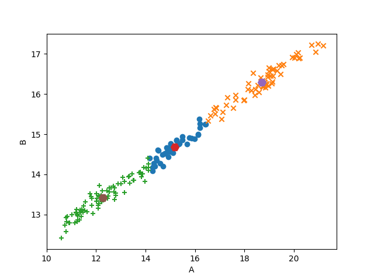

# Wheat Seed k-means Clustering
Applying k-means clustering to a dataset on variety of wheat seeds using C++ &amp; CUDA.

Group Members:
- David Nguyen d_nguyen@csu.fullerton.edu / david@knytes.com / [@david-kishi](www.github.com/david-kishi)

## Getting Started

### Prerequisites
- System with CUDA, Python, Pandas, and Matplotlib installed
    - CSUF students/staff, ssh into aries

### To run program:
1.	In terminal, change to root directory with file wheat_cluster.cu
2.	Run `nvcc wheat_cluster.cu` to build the program.
3.	Run `./a.out` to run program.
4.	Run `python make_plots.py` to make a scatterplot.
5.	Success! You can view your plot in the plots directory.

## Example outputs
